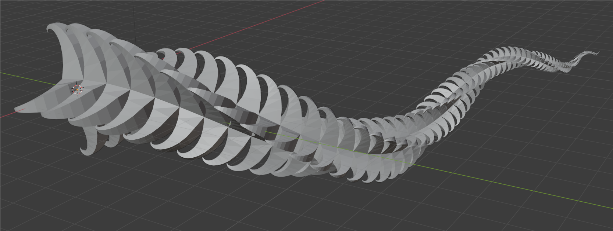
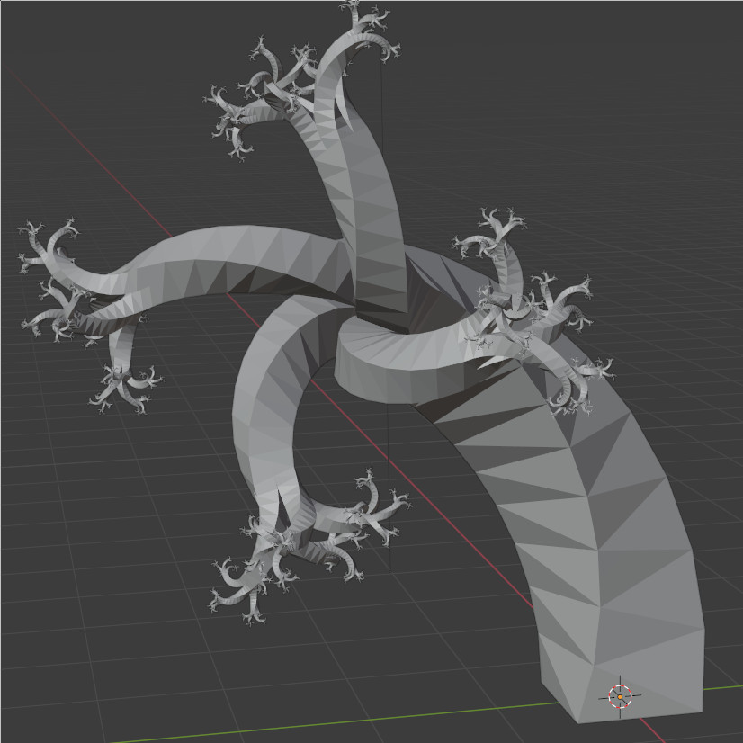
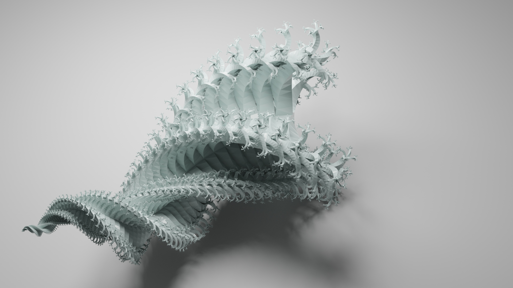
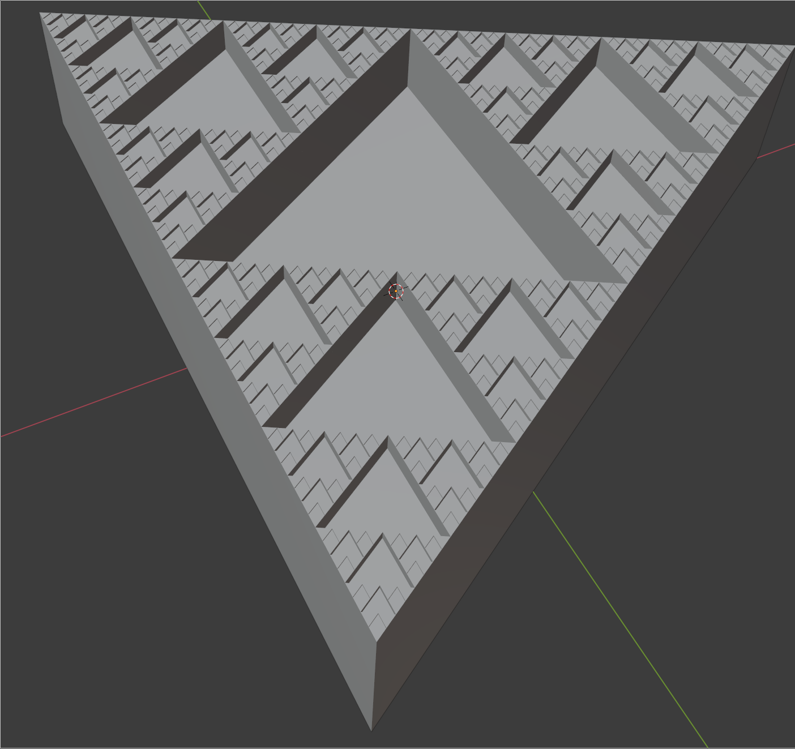
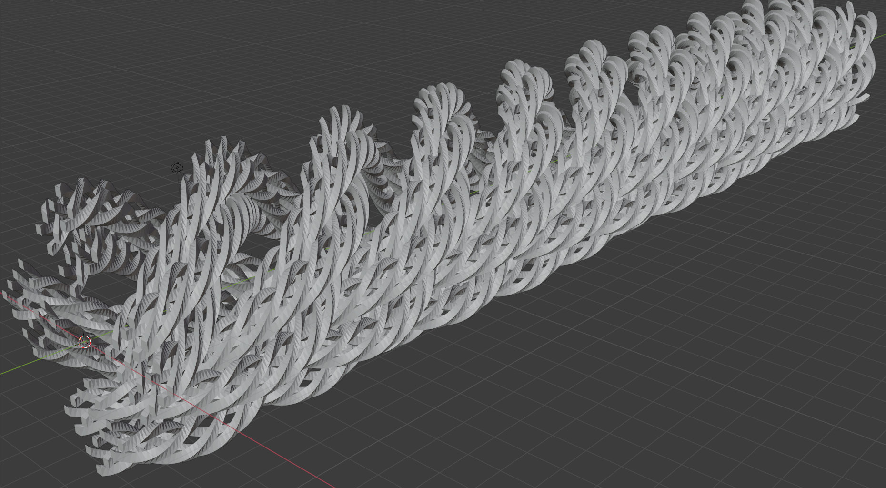

# Prosha

Experiments in procedural meshes in Rust

More detailed docs and examples forthcoming.

## General Notes & History

This particular code base was started around 2019 December
as an attempt to make meshes in a more "generative" style,
described by recursive grammars and replacement rules.  One
main goal was to make it easy to produce manifold meshes by
following certain rules, and do so in a
"correct-by-construction" manner rather than by having to
patch up or subdivide the meshes in post-processing.
(This particular notion came out of some older work in 2018.
See 2018-06-26 paper notes. Paper notes around 2019-09
developed this further still.)

These grammars by their nature worked in discrete steps,
but at one point I tried (unsuccessfully) to extend this
system to working in a more continuous and parametric
way.  (See `parametric_mesh` and any DCEL code.)
The Python code I had written around 2019 September used
something like a discrete approximation of this, and its
limitations are part of why I started on this new version.

I also ran into problems anytime I wanted to produce
meshes in a way that was more "refining" than "generative".
They're not completely distinct. However, the specific issue
I ran into is that the rules were explicitly designed around
'child' rules never being able to modify topology of geometry
from a 'parent' rule, besides being able to connect to its
vertices - and sometimes the "refining" part of things
required this in order to work right.

The problems with the parametric/continuous, and the
aforementioned "refining", were related. The issue is that
in order to get good meshes, I needed to be able to minimize
approximation error with the triangles and avoid triangles
with extreme angles, and there was seemingly no good way to
do this by incremental construction (like I was trying to
use elsewhere in my model) - and so its seems I just ended up
reinventing, badly, a lot of existing work with subdivision
and meshing.

I've also disliked how much my model felt like it tied me
down to the "triangle mesh" representation. I haven't
found a good way to build up higher-level representations
to modularise and compose - but haven't given up yet on
this.  In some sense it is a conflict of goals because
the aim was correct-by-construction triangle meshes.

Also, I did this in order to learn the Rust language, and I
repeatedly kept bumping into the conclusion that Rust was
just not the right language for this. I was in need of things
like closures and first-class functions and I neglected to
consider how much those assume the presence of garbage
collection. Really, I wanted a Lisp, and then the presence of
a REPL would have been another bonus.

I appear to have implemented a bunch of this solely to delay
evaluation and let me reify the call graph in order to let me do
things like trampolining to limit call stack depth. In theory it
would let me analyze it better, but I'm not doing any of that.
A lot of what I wrote here ended up just being a buggy, half-assed
interpreter for a buggy, half-assed EDSL/minilanguage.
(Greenspun's Tenth Rule of Programming, anyone?)

On top of this, my implementation is pretty slow when it is
using a large number of rules each producing small geometry
(which is almost literally the only way it *can* be used
if you want to produce a fairly complex mesh). I did some
profiling some months ago that showed I was spending the
vast majority of my time in `extend()` and `clone()` for
`Vec` - and so I could probably see some huge performance
gains if I could simply pre-allocate vectors and share geometry
more. Also, I'm pretty sure this code does some very task-parallel
elements (e.g. anytime a rule branches), and multithreading should
be able to exploit this if I care.

If I actually understood my goals enough to put better
constraints on my model, Rust probably would have been fine.
As it stands now, the lack of clarity in both my theory
and in my implementation is a far bigger issue than anything
related to Rust.

Around early October 2020 I decided to scrap almost all of this and
write everything simply as direct function calls, despite that this uses
more stack space than I'd like. This started in the `un_greenspun`
branch, thus named because I needed to get rid of my buggy
implementation of half of Common Lisp. It paid off quite quickly and
also was vastly faster at generating meshes. 

## What does the name mean?

Nothing, but it's better than its previous name of
"mesh_scratch". I asked for name suggestions, and someone came up
with this one.

## Highest priority:

- Work on abstraction/composition.  Particularly: factor out
  patterns I use, and be able to *compose* procedural meshes
  somehow - e.g. the 'context' object I discussed. 
- Docs on modules
- Make some examples that are non-deterministic!
- swept-isocontour stuff from
  `/mnt/dev/graphics_misc/isosurfaces_2018_2019/spiral*.py`.  This
  will probably require that I figure out parametric curves
  (is this stuff still possible?)
- Make an example that is more discrete-automata, less
  approximation-of-space-curve.

- Catch-alls:
  - Grep for all TODOs in code, really.
  - Look at everything in `README.md` in `automata_scratch`,
    my old Python code from around 2019-09.

## If I'm bored:

- Look in https://www.nalgebra.org/quick_reference/# for "pour
  obtain".  Can I fix this somehow?  Looks like a French-ism that made
  its way in.
- Multithread!  This looks very task-parallel anywhere that I branch.
- Use an actual logging framework.
- How can I take tangled things like the cinquefoil and produce more
  'iterative' versions that still weave around?

## Research Areas

- Can I use automatic differentiation in any way here to avoid the
  numerical annoyances?
- [Geometry and Algorithms for Computer Aided Design (Hartmann)](https://www2.mathematik.tu-darmstadt.de/~ehartmann/cdgen0104.pdf)
- https://en.wikipedia.org/wiki/Surface_triangulation
- https://www.cs.cmu.edu/~quake/triangle.html
- OpenSubdiv!

## Reflections & Quick Notes

- Generalizing to space curves moves this away from the "discrete
  automata" roots, but it still ends up needing the machinery I made
  for discrete automata.
- If you *pre* multiply a transformation: you are transforming the
  entire global space.  If you *post* multiply: you are transforming
  the current local space. 
- Don't reinvent subdivision surfaces.
- Don't reinvent Lisp when you wanted a Lisp!

## Examples

### Barbs

See `examples::Barbs` & "barbs" test in `lib.rs`.

### Tree Thing

See `examples::TreeThing`.  First one is "tree_thing" test in `lib.rs`:

Second is "tree_thing2" (this was from a larger Blender render):

### Sierpinski

See `examples::Sierpinski` & "sierpinski" test in `lib.rs`.
This looks cooler with some randomness added and 3D printed.

### Triple Nested Spiral

See `examples::NestedSpiral` & "nested_spiral" test in `lib.rs`.

